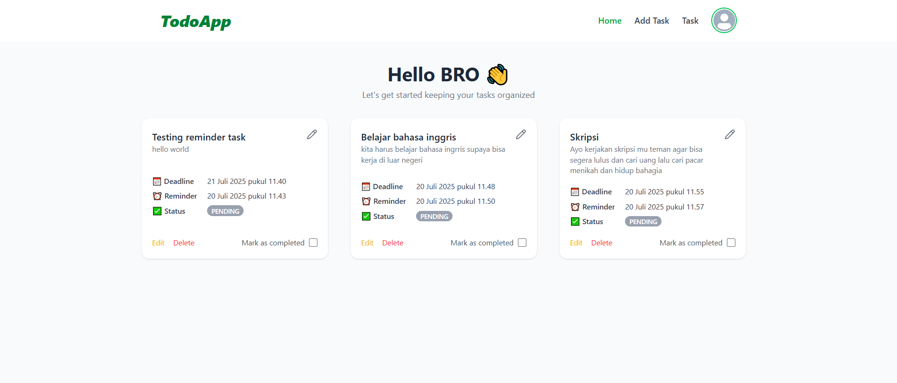
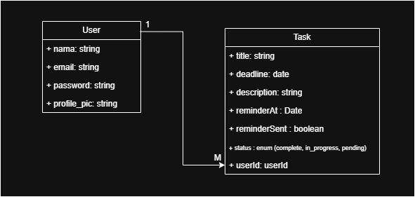

# 📝 Todolist App - Next.js Project

Ini adalah proyek sederhana Todolist yang saya buat sebagai bagian dari proses pembelajaran menggunakan **Next.js**. Meskipun masih dalam tahap pengembangan awal, aplikasi ini telah memiliki fitur dasar yang berguna untuk manajemen tugas harian.

## ✨ Fitur Utama

1. **Autentikasi User**  
   Pengguna dapat melakukan **registrasi** dan **login** ke dalam aplikasi.

2. **Manajemen Tugas (CRUD)**  
   Pengguna dapat menambahkan, mengedit, menghapus, dan melihat daftar tugas mereka.

3. **Filtering Tugas**  
   Tugas dapat difilter berdasarkan **status** seperti *selesai* atau *belum selesai*.

4. **Notifikasi Email Otomatis**  
   Aplikasi ini mengirimkan notifikasi melalui email menggunakan **SendGrid**.

---

## 🛠️ Teknologi & Tools

- **Next.js (App Router)** – Untuk mengelola komponen *server* dan *client*.
- **Prisma** – ORM yang digunakan untuk mengelola dan berinteraksi dengan database.
- **SendGrid** – Digunakan sebagai platform pengiriman email otomatis.
- **Cloudinary** – Untuk mengunggah dan menyimpan foto profil pengguna.
- **shadcn/ui** – Library UI modern berbasis Tailwind CSS.

---

## 🖼️ Tampilan Aplikasi

Berikut adalah cuplikan tampilan antarmuka aplikasi:

> 🖼️ **Screenshot Halaman Utama**
>
> 

---

## 📊 Skema Database (ERD)

> 📌 **Gambar ERD (Entity Relationship Diagram)**
>
> 

---

## 🚀 Status Pengembangan

Proyek ini masih dalam tahap pengembangan dan eksplorasi fitur-fitur lanjutan. Masukan dan saran sangat diterima untuk pengembangan lebih lanjut 🙌.

---

## 📬 Kontak

Jika Anda memiliki pertanyaan, saran, atau ingin berdiskusi lebih lanjut, silakan hubungi saya melalui email atau GitHub.

---

